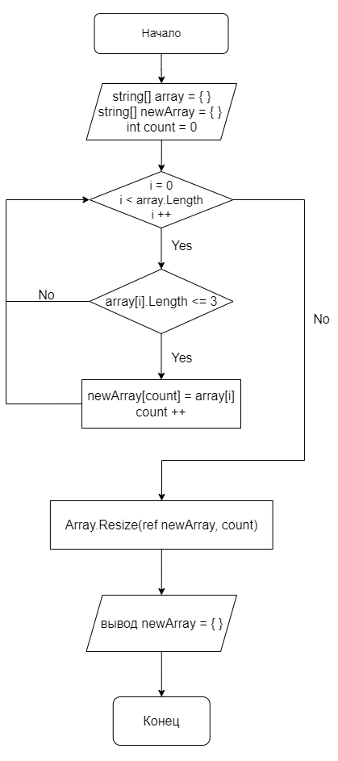

# Описание решения

## Вариант №1 решения через метод Resize()
Задаем первоначальный массив _**array**_ c типом данных *string*:

> string[] array = {"Hello", "2", "world", ":-)"};

Выводим его на печать:

> System.Console.WriteLine($"[{string.Join(", ", array)}]");

Задаем новый массив размером с первоначальный, который необходимо заполнить по условию задачи, _**newArray**_ с типом данных *string*:

> string[] newArray = new string[array.Length];

Добавляем счетчик _**count**_ с типом данных *int*, который будет необходим для заполнения и изменения размера нового массива:

> int count = 0;

Запускаем цикл *for* по значениям первоначального массива:

>for (int i = 0; i < array.Length; i++)  
>{  

Добавляем оператор *if*, в логическом выражении которого проверяем каждый элемент массива _**array[i]**_ на длину символов меньше либо равное трём. В случае выполнения условия заполняем массив и увеличиваем счетчик _**count**_:

>    if (array[i].Length <= 3)  
>    {  
>        newArray[count] = array[i];  
>        count ++;  
>    }  
>}  

Используем метод *Array.Resize( )* для уменьшения искомого массива, ввиду наличия пустых элемнтов:

>Array.Resize(ref newArray, count);

Вывод искомого массива в терминале:

>System.Console.WriteLine($"[{string.Join(", ", newArray)}]");

## Блок схема кода

## Примечание
В програмном коде присутствует закоментированное решение задачи без использования метода *Array.Resize( )* с использованием двух циклов *for*.

Первый цикл определяет размер нового массива с помощью переменной _**count**_:

>for (int i = 0; i < array.Length; i++)  
>{  
>     if (array[i].Length <= 3)  
>     {  
>         count ++;  
>     }  
>}  

Выделение памяти под новый массив размера count, обнуляем счетчик:

>string[] newArray = new string[count];  
>count = 0;

Второй цикл заполняет массив:

>for (int i = 0; i < array.Length; i++)  
>{  
>     if (array[i].Length <= 3)  
>     {  
>         newArray[count] = array[i];  
>         count++;  
>     }  
> }  

Вывод на печать

>System.Console.WriteLine($"[{string.Join(", ", newArray)}]");